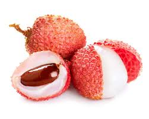

## Introduction
Hi! I'm Anirudh Nayak, a second year CS major. 
The following page will help you get to know me a little bit better.

## Favorite things
#### Categories
1.  [Favorite fruit](#favorite-fruit)
2. [Favorite quote](#favorite-quote)
3. [Favorite programming language](#favorite-programming-language)


#### Favorite fruit
<ins>Lychees</ins> are my favorite fruit, as shown below: 

 \
<sup> This image was sourced from  [Britannica](https://www.britannica.com/plant/litchi-fruit). <sup>
#### Favorite quote

> Fall down seven times, stand up eight.

You can read my thoughts on this quote [here](quote_thoughts.md).


#### Favorite programming language

For me, this would be [Kotlin](https://kotlinlang.org/). Here's some example Kotlin code that computes the nth Fibonacci number for some natural number n.

```kotlin
fun fib(n: Int): Int {
    if (n <= 1) return n
    return fib(n-1) + fib(n-2)
}
```

## Recently played games
- Slay the Spire 
- osu!
- Demon Bluff

## Bucket list
- [x]  See the aurora borealis
- [x]  Go snorkeling in a coral reef
- [ ]  Road trip across the US   
- [ ]  Learn a new language
